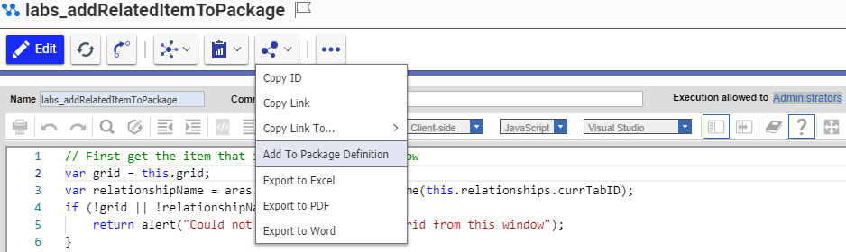
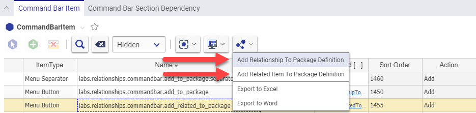

# CUI Add to Package

ItemTypes, Methods, and other configuration items can be shared between Innovator instances by creating packages to use with the [Package Import/Export Utilities](https://www.aras.com/support/downloads/). There is a convenient function available from the menu of the main grid under **Tools > Admin > Add to Package Definition** that can be used to quickly add items to existing package or to create new packages altogether. 

This project uses CUI to create a similar menu buttons to add items from Item Forms as well as the Relationships Grid.

## History
This project and the following release notes have been migrated from the old Aras Projects page.

Release | Notes
--------|--------
[v2.1](https://github.com/ArasLabs/cui-add-to-package/releases/tag/v2.1) | Bug fixes
[v2.0](https://github.com/ArasLabs/cui-add-to-package/releases/tag/v2.0) | Updated for 12.0
[v1](https://github.com/ArasLabs/cui-add-to-package/releases/tag/v1) | Initial Release

#### Supported Aras Versions

Project | Aras
--------|------
[v2.1](https://github.com/ArasLabs/cui-add-to-package/releases/tag/v2.1) | 12.0 SP4, 12.0 SP5
[v2.0](https://github.com/ArasLabs/cui-add-to-package/releases/tag/v2.0) | 12.0
[v1](https://github.com/ArasLabs/cui-add-to-package/releases/tag/v1) | 11.0 SP15, 11.0 SP12

_Note: [v2.0](https://github.com/ArasLabs/cui-add-to-package/releases/tag/v2.0) of this project was built and tested using 12.0 and is not back-compatible with older versions of Aras Innovator due to CUI changes. [v1](https://github.com/ArasLabs/cui-add-to-package/releases/tag/v1) of this project project was built and tested using 11.0 SP15, but it should work in any version of Aras Innovator 11.0 greater than 11.0 SP7_

## Installation

#### Important!
**Always back up your code tree and database before applying an import package or code tree patch!**

### Pre-requisites
1. Aras Innovator installed
2. Aras Package Import tool
3. **aras.labs.cui.AddToPackage** import package

### Install Steps

#### Database Installation
1. Backup your database and store the BAK file in a safe place.
2. Open up the Aras Package Import tool.
3. Enter your login credentials and click **Login**
  * _Note: You must login as root for the package import to succeed!_
4. Enter the package name in the TargetRelease field.
  * Optional: Enter a description in the Description field.
5. Enter the path to your local `..\CUI Add to Package\Imports\imports.mf` file in the Manifest File field.
6. Select both packages in the Available for Import field.
7. Select Type = **Merge** and Mode = **Thorough Mode**.
8. Click **Import** in the top left corner.
9. Close the Aras Package Import tool.

## Usage (Item Window)

1. Login as admin
	* This action will be hidden from non-adminsitrator users
2. Open any Item
3. In the Item's window or tab, select **Share > Add to Package Definition**
	* 
4. Choose a package to add this item to
5. Click **OK**
6. Confirm that this Item was added to the package
	* You can find the packages in your system in the TOC under **Administration > Configuration > PackageDefinitions**

## Usage (Relationships Grid)

1. Login as admin
	* This action will be hidden from non-administrator users
2. Open any Item with a relationship
3. In the relationships grid, click the **Share** button to see two new actions
	* 
	* **Add Relationship to Package Definition** adds the relationship item (e.g. Server Event) to the package
	* **Add Related to Package Definition** adds the related item (e.g. the Method of a server event) to the package
4. Choose one of the two options based on what you wish to add
5. Choose a package to add this item to
6. Click **OK**
7. Confirm that this relationship or related Item was added to the package

## Contributing

1. Fork it!
2. Create your feature branch: `git checkout -b my-new-feature`
3. Commit your changes: `git commit -am 'Add some feature'`
4. Push to the branch: `git push origin my-new-feature`
5. Submit a pull request

## Credits

Created by Christopher Gillis for Aras Labs. @cgillis-aras

## License

Published to Github under the MIT license. See the [LICENSE file](./LICENSE.md) for license rights and limitations.
